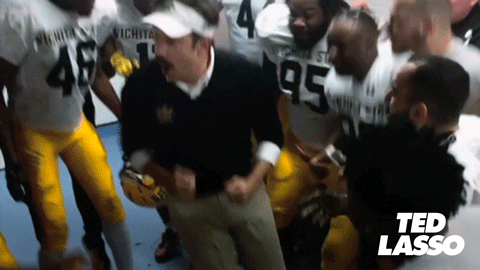

# My First Coding Assignment
<html>

</html>

## About Me
Hello, my name is Michelle and I am currently studying at the University of Florida. I love spending time with my friends.

## Past Coding Experience
Absolutely none in website design. When website designing, I use WYSIWYG's. I wrote some code for a program (MatLab) but that was more engineer/math-based coding.

## Career Goals
1. Make a personal website for myself
2. Understand more about SEO and how websites are found.
3. Impress my boss, who manages our org's entire website, with new skills I've picked up.